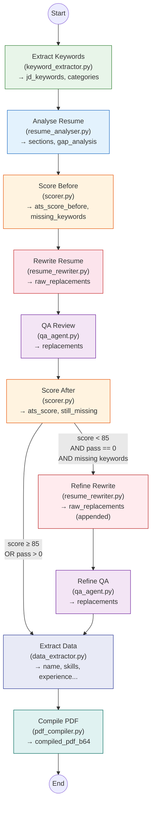

# LangGraph Multi-Agent Pipeline

## Overview

The AI logic uses **LangGraph** to orchestrate a **multi-agent pipeline with a conditional refinement loop**. Each agent is a standalone node with a single responsibility, reading from and writing to a shared `AgentState` TypedDict.

All agents use a multi-provider LLM (Groq or Google Gemini, configured via `LLM_PROVIDER` env var) with temperature 0.2 via `llm.py`. All text understanding, scoring, and validation is done by the LLM — no regex-based text parsing or algorithmic keyword matching.

## Pipeline Flow

```
extract_keywords → analyse_resume → score_before → rewrite_resume → qa_review
→ score_after →  ┌─ [score ≥ 85] → extract_data → compile_pdf → END
                  └─ [score < 85] → refine_rewrite → refine_qa → extract_data → compile_pdf → END
```



## Design Principles

1. **LLM-first** — All text understanding (scoring, matching, validation) is done by the LLM. No algorithmic keyword matching, fuzzy matching, synonym maps, or regex-based text parsing.
2. **Single responsibility** — Each agent does ONE thing. Scoring is separate from data extraction. Rewriting is a single agent (not 3 parallel section-specific rewriters).
3. **No regex for text understanding** — Regex is only used where genuinely appropriate: LaTeX syntax handling, input sanitisation, and prompt injection detection.
4. **Simple refinement** — If score < 85 after the first pass, ONE refinement pass targets unmodified resume sections with still-missing keywords.

## Agent Details

### Agent 1 — Keyword Extractor (`keyword_extractor.py`)

**Input**: `jd_text`
**Output**: `jd_keywords`, `keyword_categories`

Extracts 30–60 unique keywords from the job description and categorises them (technical skills, tools/platforms, domain knowledge, soft skills, certifications, action verbs).

### Agent 2 — Resume Analyser (`resume_analyser.py`)

**Input**: `resume_text`, `jd_keywords`
**Output**: `resume_sections`, `gap_analysis`, `missing_keywords`

Identifies resume sections, maps which keywords are present vs missing, and produces a gap analysis with placement recommendations.

### Agent 3 — Pre-Rewrite Scorer (`scorer.py`)

**Input**: `resume_text`, `jd_keywords`
**Output**: `ats_score_before`, `missing_keywords`

Pure LLM scoring. The LLM evaluates keyword coverage, considering exact matches, synonyms, abbreviations, and contextual relevance. Returns a 0–100 score and the list of missing keywords.

### Agent 4 — Resume Rewriter (`resume_rewriter.py`)

**Input**: `resume_text`, `keyword_categories`, `missing_keywords`, `gap_analysis`
**Output**: `raw_replacements` (list of `{old, new}` dicts)

Single rewriter for ALL resume sections (skills, summary, experience). Generates old→new text replacements:
- `old` must be **verbatim** from the original resume
- `new` must be within **±20%** of the same length
- Each keyword appears at **most 2 times** across all replacements
- Skills section gets missing technical keywords as comma-separated items
- Experience bullets get 2–3 relevant keywords each, spread evenly
- All metrics and numbers preserved

Also provides `refine_rewrite()` for the second pass, which targets resume sections NOT modified in the first pass to inject still-missing keywords.

### Agent 5 — QA Agent (`qa_agent.py`)

**Input**: `resume_text`, `jd_keywords`, `raw_replacements`
**Output**: `replacements` (list of `TextReplacement`)

Pure LLM validation. Reviews each replacement for:
- Verbatim `old` text accuracy
- Keyword duplication (>2 occurrences → use synonyms)
- Metric preservation
- Filler removal
- Length constraints (±20%)
- Natural language quality (no AI-sounding words)

### Agent 6 — Post-Rewrite Scorer (`scorer.py`)

**Input**: `resume_text`, `jd_keywords`, `replacements`
**Output**: `ats_score`, `matched_keywords`, `still_missing_keywords`

Same LLM scoring as Agent 3, applied to the rewritten resume text (after replacements). Reports `still_missing_keywords` used by the conditional refinement.

### Conditional Refinement (if score < 85 AND pass == 0)

The refinement rewriter (`refine_rewrite`) targets parts of the resume NOT modified in the first pass. Followed by the same QA review.

### Agent 7 — Data Extractor (`data_extractor.py`)

**Input**: `resume_text`, `replacements`
**Output**: `name`, `email`, `phone`, `linkedin`, `github`, `location`, `summary`, `skills`, `experience`, `education`, `certifications`

Applies replacements to the resume text, then uses the LLM to extract structured fields for the API response.

### Agent 8 — PDF Compiler (`pdf_compiler.py`)

**Input**: `replacements`, `resume_file_b64`, `resume_file_type`
**Output**: `compiled_pdf_b64`

Applies validated replacements to the original file:
- **PDF uploads** → `rewriter.py` (PyMuPDF in-place text replacement)
- **LaTeX uploads** → `latex_rewriter.py` (source patching + xelatex/pdflatex compilation)

## Pipeline Run Tracking

Every pipeline execution is tracked in MongoDB via `db.py` (best-effort):

1. A run is created at the start of `generate_resume()` with status `"running"`
2. Each agent is wrapped by `_tracked()` in `graph.py`, which records:
   - Agent name and execution duration (ms)
   - Input summary (relevant state keys only)
   - Output data (serialised, truncated for storage)
3. On success: final result saved with ATS scores, replacement count, and name
4. On failure: error message saved

The run ID is stored in a `contextvars.ContextVar` for thread-safe tracking.

## Shared State (`state.py`)

`AgentState` is a `TypedDict` with annotated reducers:
- **`raw_replacements`** uses `_merge_lists` (accumulates across rewrite passes)
- **Everything else** uses `_overwrite` (last-write-wins)

Key state fields:

| Category | Fields |
|----------|--------|
| Inputs | `resume_text`, `jd_text`, `resume_file_b64`, `resume_file_type` |
| Keywords | `jd_keywords` (list, merge), `keyword_categories` (dict, overwrite) |
| Analysis | `resume_sections`, `gap_analysis`, `missing_keywords` |
| Rewriting | `raw_replacements` (list, merge), `replacements` (list, overwrite) |
| Scoring | `ats_score_before`, `ats_score`, `matched_keywords`, `still_missing_keywords`, `rewrite_pass` |
| Structured Data | `name`, `email`, `phone`, `linkedin`, `github`, `location`, `summary`, `skills`, `experience`, `education`, `certifications` |
| PDF | `compiled_pdf_b64` |

## LLM Configuration (`llm.py`)

The LLM provider is selected by the `LLM_PROVIDER` env var (`"groq"` or `"gemini"`).

| Parameter | Groq | Gemini |
|-----------|------|--------|
| Model | `llama-3.3-70b-versatile` (configurable via `GROQ_MODEL`) | `gemini-2.0-flash` (configurable via `GEMINI_MODEL`) |
| Temperature | `0.2` | `0.2` |
| Max tokens | `8192` | `8192` |
| Provider | `langchain-groq` (`ChatGroq`) | `langchain-google-genai` (`ChatGoogleGenerativeAI`) |

`parse_llm_json()` safely extracts JSON from LLM responses, handling markdown code fences. Includes lightweight JSON repair for truncated output (trailing comma removal + bracket closure).

## Public API (`graph.py`)

```python
from backend.services.agents import generate_resume

resume_data, compiled_pdf_b64 = generate_resume(
    resume_text, jd_text,
    resume_file_b64="<base64-encoded original file>",
    resume_file_type="pdf",  # or "tex"
)
```

Returns `(ResumeData, compiled_pdf_b64)`.
