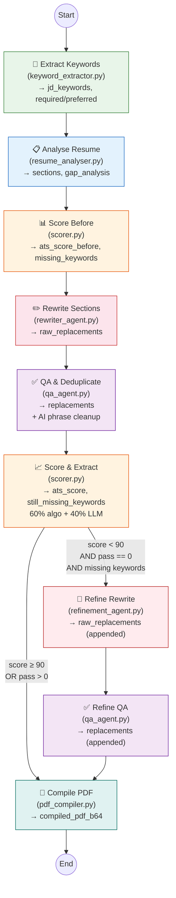

# LangGraph Multi-Agent Pipeline

## Overview

The AI logic uses **LangGraph** to orchestrate a **multi-agent pipeline with a conditional refinement loop**. Each agent is a standalone node that reads from and writes to a shared `AgentState` TypedDict.

All agents use a multi-provider LLM (Groq or Google Gemini, configured via `LLM_PROVIDER` env var) with temperature 0.2 via `llm.py`.

## Pipeline Flow

```
extract_keywords → analyse_resume → score_before → rewrite_sections → qa_deduplicate
→ score_extract →  ┌─ [score ≥ 90] → compile_pdf → END
                    └─ [score < 90] → refine_rewrite → refine_qa → compile_pdf → END
```



## Key Improvements

1. **Hybrid Scoring** — Combines deterministic word-boundary regex matching (60% weight) with LLM semantic scoring (40% weight) for accurate, verifiable ATS scores.
2. **Priority Keywords** — Extracts `required_skills` vs `preferred_skills` from JD so the rewriter prioritises must-have keywords.
3. **Missing Keyword Focus** — The rewriter receives explicit lists of MISSING keywords (not all keywords) with priority levels (REQUIRED / PREFERRED / OTHER).
4. **Conditional Refinement Loop** — If the first-pass score is below 90, a focused refinement agent injects still-missing keywords into the already-rewritten resume.
5. **AI Phrase Cleanup** — Replaces AI-sounding buzzwords ("spearheaded", "leveraged", "synergized") with simpler human-sounding alternatives.
6. **Algorithmic Keyword Matcher** — `keyword_matcher.py` provides deterministic word-boundary matching to verify which keywords actually appear in text.

## Agent Details

### Agent 1 — Keyword Extractor (`keyword_extractor.py`)

**Input**: `jd_text`
**Output**: `jd_keywords`, `keyword_categories`, `required_keywords`, `preferred_keywords`

Extracts 30–60 unique keywords from the job description and categorises them into:
- `technical_skills`, `soft_skills`, `tools_platforms`
- `domain_knowledge`, `certifications`, `action_verbs`
- `required_skills` — must-have keywords from core requirements
- `preferred_skills` — nice-to-have keywords from secondary mentions

### Agent 2 — Resume Analyser (`resume_analyser.py`)

**Input**: `resume_text`, `jd_keywords`
**Output**: `resume_sections`, `gap_analysis`

- Identifies resume sections (summary, skills, each experience entry, education)
- Maps which keywords are already present vs missing
- Produces a gap analysis with specific placement recommendations

### Agent 3 — Pre-Rewrite Scorer (`scorer.py`)

**Input**: `resume_text`, `jd_keywords`, `keyword_categories`
**Output**: `ats_score_before`, `missing_keywords`

Scores the **original** resume using **hybrid scoring**:
- Algorithmic: word-boundary regex matching with category weights (tech skills 1.5x)
- LLM: semantic keyword coverage assessment
- Final score: conservative estimate (lower of LLM and algorithmic)
- Also identifies which keywords are missing from the original resume

### Agent 4 — Rewriter (`rewriter_agent.py`)

**Input**: `resume_text`, `keyword_categories`, `gap_analysis`, `missing_keywords`, `required_keywords`, `preferred_keywords`
**Output**: `raw_replacements` (list of `{old, new}` dicts)

Generates old→new text replacements with strict rules:
- `old` must be **verbatim** from the original resume (character-for-character)
- `new` must be within **±20%** of the same length
- Each keyword appears at **most 2 times** across all replacements
- Keywords are spread evenly; synonyms/variations are used
- Receives explicit priority blocks: 🔴 REQUIRED → 🟡 PREFERRED → 🟢 OTHER missing keywords
- Prioritises skills section as the "easiest win" for keyword injection

### Agent 5 — QA Agent (`qa_agent.py`)

**Input**: `resume_text`, `jd_keywords`, `raw_replacements`
**Output**: `replacements` (list of `TextReplacement` Pydantic models)

Validates and fixes:
1. Checks each `old` text exists in the original resume
2. Counts keyword frequency across all `new` texts, flags overuse (>2)
3. Instructs LLM to fix duplicates with synonyms
4. Programmatic dedup safety net (removes duplicate `old` entries)
5. Enforces skills section format consistency
6. **AI phrase cleanup**: replaces 30+ AI-sounding phrases with simpler alternatives (e.g. "spearheaded" → "led", "leveraged" → "used")

### Agent 6 — Final Scorer (`scorer.py`)

**Input**: `resume_text`, `jd_keywords`, `jd_text`, `replacements`, `keyword_categories`
**Output**: `ats_score`, `matched_keywords`, `algorithmic_score`, `still_missing_keywords`, `name`, `email`, `skills`, `experience`, etc.

- Applies replacements to produce the "final resume" text
- Runs **hybrid scoring**: 60% algorithmic (word-boundary) + 40% LLM (semantic)
- Reports `still_missing_keywords` used by the refinement loop
- Extracts structured fields needed by `ResumeData`

### Conditional Refinement (if score < 90)

### Agent 6b — Refinement Writer (`refinement_agent.py`)

**Input**: `resume_text`, `replacements`, `still_missing_keywords`, `required_keywords`
**Output**: `raw_replacements` (appended), `rewrite_pass` = 1

Targeted second-pass keyword injection:
- Applies existing replacements to get current resume text
- Focuses specifically on `still_missing_keywords`, prioritising required ones
- Targets skills section and summary as highest-impact areas
- Uses exact JD phrasing for ATS compatibility
- Only runs once (pass 0 → pass 1, no further loops)

### Agent 6c — Refinement QA (`qa_agent.py`)

Same QA agent as Agent 5, validates the refinement replacements.

### Agent 7 — PDF Compiler (`pdf_compiler.py`)

**Input**: `replacements`, `resume_file_b64`, `resume_file_type`
**Output**: `compiled_pdf_b64`

Applies the validated replacements to the original file and produces the final PDF:
- **PDF uploads** → `rewriter.py` (PyMuPDF in-place text replacement)
- **LaTeX uploads** → `latex_rewriter.py` (source patching + xelatex/pdflatex compilation)

If no original file is available, returns an empty string (the pipeline can still return structured `ResumeData` without a compiled file).

## Pipeline Run Tracking

Every pipeline execution is tracked in MongoDB via `db.py` (best-effort):

1. A run is created at the start of `generate_resume()` with status `"running"`
2. Each agent is wrapped by `_tracked()` in `graph.py`, which records:
   - Agent name and execution duration (ms)
   - Input summary (relevant state keys only)
   - Output data (serialised, truncated for storage)
3. On success: final result saved with ATS scores, replacement count, and name
4. On failure: error message saved

The run ID is stored in a `contextvars.ContextVar` for thread-safe tracking.

## Shared State (`state.py`)

`AgentState` is a `TypedDict` with annotated reducers:
- **List fields** use `_merge_lists` (extend, not replace)
- **Scalar/dict fields** use `_overwrite` (last-write-wins)

Key state fields:

| Category | Fields |
|----------|--------|
| Inputs | `resume_text`, `jd_text`, `resume_file_b64`, `resume_file_type` |
| Agent 1 | `jd_keywords` (list, merge), `keyword_categories` (dict, overwrite), `required_keywords` (list, overwrite), `preferred_keywords` (list, overwrite) |
| Agent 2 | `resume_sections` (dict, overwrite), `gap_analysis` (str, overwrite) |
| Agent 3 | `ats_score_before` (int, overwrite), `missing_keywords` (list, overwrite) |
| Agent 4 | `raw_replacements` (list, merge) |
| Agent 5 | `replacements` (list[TextReplacement], merge) |
| Agent 6 | `ats_score` (int), `matched_keywords` (list, overwrite), `algorithmic_score` (float, overwrite), `still_missing_keywords` (list, overwrite), structured fields |
| Refinement | `rewrite_pass` (int, overwrite) — tracks which pass we're on (0 = initial, 1 = refinement) |
| Agent 7 | `compiled_pdf_b64` (str, overwrite) |

## LLM Configuration (`llm.py`)

The LLM provider is selected by the `LLM_PROVIDER` env var (`"groq"` or `"gemini"`).

| Parameter | Groq | Gemini |
|-----------|------|--------|
| Model | `llama-3.3-70b-versatile` (configurable via `GROQ_MODEL`) | `gemini-2.0-flash` (configurable via `GEMINI_MODEL`) |
| Temperature | `0.2` | `0.2` |
| Max tokens | `8192` | `8192` |
| Provider | `langchain-groq` (`ChatGroq`) | `langchain-google-genai` (`ChatGoogleGenerativeAI`) |

`parse_llm_json()` safely extracts JSON from LLM responses, handling markdown code fences. Includes a multi-pass JSON repair pipeline for truncated or malformed output (trailing comma removal → bracket closure → regex object extraction).

## Public API (`graph.py`)

```python
from backend.services.agents import generate_resume

resume_data, compiled_pdf_b64 = generate_resume(
    resume_text, jd_text,
    resume_file_b64="<base64-encoded original file>",
    resume_file_type="pdf",  # or "tex"
)
```

Returns `(ResumeData, compiled_pdf_b64)`. Drop-in replacement for the previous monolithic `groq_service.generate_resume()`.
