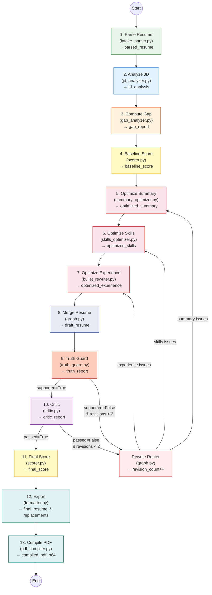

# LangGraph Multi-Agent Pipeline

## Overview

The AI logic uses **LangGraph** to orchestrate a **13-node multi-agent pipeline with conditional revision loops**. Each agent is a standalone node with a single responsibility, reading from and writing to a shared `ResumeGraphState` TypedDict.

The pipeline combines **LLM-based intelligence** (via Groq or Gemini) with **deterministic scoring utilities** (`tools.py`) for a hybrid approach: the LLM handles text understanding, rewriting, and semantic evaluation, while `tools.py` provides repeatable keyword coverage, bullet quality, and ATS format checks.

## Pipeline Flow

```
parse_resume → analyze_jd → compute_gap → baseline_score
→ optimize_summary → optimize_skills → optimize_experience
→ merge_resume → truth_guard →[pass]→ critic →[pass]→ final_score
                       │                  │
                       └──[fail]──→ rewrite_router ←──[fail]──┘
                                        │
                              ┌─────────┼─────────┐
                              ▼         ▼         ▼
                        optimize_   optimize_  optimize_
                        experience  summary    skills
                              └─────────┼─────────┘
                                        ▼
                                   merge_resume  (loop, max 2 revisions)

final_score → export → compile_pdf → END
```



## Design Principles

1. **Hybrid scoring** — Deterministic tools (`tools.py`) compute keyword coverage via rapidfuzz, bullet quality metrics, and ATS format checks. The LLM provides semantic scoring. Both are combined into a weighted composite (see Scoring Formula below).
2. **Section-specific optimizers** — Summary, skills, and experience each have a dedicated optimizer with tailored prompts and hard rules, enabling targeted revision loops.
3. **Truth-first safety** — The truth guard agent verifies every claim against the original resume before any scoring or export. Fabricated content is flagged and triggers revision.
4. **Bounded revision loops** — The critic and truth guard can route back to specific optimizers, but the `_MAX_REVISIONS` limit (2) prevents infinite loops.
5. **Deterministic reproducibility** — The tools in `tools.py` use no LLM calls, ensuring scoring components are repeatable and auditable.

## Scoring Formula

The ATS score is computed by `tools.compute_ats_score()`:

```
score = 0.30 × keyword_coverage    (rapidfuzz token_set_ratio ≥ 80)
      + 0.25 × semantic_score       (LLM 0–100, normalised)
      + 0.20 × section_quality      (LLM 0–100, normalised)
      + 0.15 × ats_format           (deterministic checks)
      + 0.10 × truthfulness         (1.0 if supported, else 0.5)
```

A stuffing penalty of −5 per stuffed keyword is applied (via `tools.detect_keyword_stuffing()`).

## Agent Details

### Agent 1 — Intake Parser (`intake_parser.py`)

**Node name**: `parse_resume`
**State reads**: `resume_text`
**State writes**: `parsed_resume`

Extracts structured JSON from the raw resume text: `basics` (name, email, phone, linkedin, github, location), `summary`, `skills` (list of strings), `experience` (list of jobs with bullets), `education`, `certifications`, and `projects`.

### Agent 2 — JD Analyzer (`jd_analyzer.py`)

**Node name**: `analyze_jd`
**State reads**: `jd_text`
**State writes**: `jd_analysis`

Extracts structured signals from the job description: `required_skills`, `preferred_skills`, `experience_level`, `key_responsibilities`, `domain_keywords`, `ats_keywords` (flat list of all ATS-relevant terms), and `company_values`.

### Agent 3 — Gap Analyzer (`gap_analyzer.py`)

**Node name**: `compute_gap`
**State reads**: `parsed_resume`, `jd_analysis`
**State writes**: `gap_report`

Two-pass analysis:
1. **Deterministic pass** — rapidfuzz matching of resume text against JD keywords.
2. **LLM pass** — semantic gap analysis producing `missing_keywords`, `weak_areas`, `strong_areas`, and section-specific `recommendations`.

Design principle: gap analysis must be **honest** — it only recommends adding keywords that can be truthfully paired with existing experience.

### Agent 4 — Baseline Scorer (`scorer.py` → `baseline_score_node`)

**Node name**: `baseline_score`
**State reads**: `parsed_resume`, `jd_analysis`, `gap_report`
**State writes**: `baseline_score`

Runs the full hybrid scoring pipeline on the **original** resume to establish a before-optimization baseline. Uses both deterministic tools and LLM evaluation.

### Agent 5 — Bullet Rewriter (`bullet_rewriter.py`)

**Node name**: `optimize_experience`
**State reads**: `parsed_resume`, `jd_analysis`, `gap_report`, `critic_report` (on revision)
**State writes**: `optimized_experience`

Rewrites experience bullets using the **Action + Tech + Scope + Result** pattern. Hard rules:
- Every number/metric preserved verbatim
- No keyword appears >2× across all bullets
- No fabricated achievements
- Each bullet starts with a strong action verb

### Agent 6 — Summary Optimizer (`summary_optimizer.py`)

**Node name**: `optimize_summary`
**State reads**: `parsed_resume`, `jd_analysis`, `gap_report`, `critic_report` (on revision)
**State writes**: `optimized_summary`

Generates a 3–4 sentence ATS-optimized professional summary. Hard rules:
- Must start with "[Title] with [N] years of experience"
- Weave in 3–5 ATS keywords naturally
- No fabricated credentials

### Agent 7 — Skills Optimizer (`skills_optimizer.py`)

**Node name**: `optimize_skills`
**State reads**: `parsed_resume`, `jd_analysis`, `gap_report`, `critic_report` (on revision)
**State writes**: `optimized_skills`

Two-pass processing:
1. **Deterministic** — `tools.normalize_skill_names()` standardises casing/variants.
2. **LLM** — reorders skills by JD priority, adds genuinely missing skills from the JD that are inferable from the resume's experience.

### Agent 8 — Truth Guard (`truth_guard.py`)

**Node name**: `truth_guard`
**State reads**: `parsed_resume`, `draft_resume`
**State writes**: `truth_report`

The most important safety agent. Two-pass verification:
1. **Deterministic** — `tools.check_unsupported_claims()` scans for metrics/numbers in the draft not present in the original.
2. **LLM** — semantic verification of each claim against source material.

Classification: `supported`, `embellished`, or `fabricated`. If any fabricated claims are found, `truth_report.supported = False`, and the pipeline routes to revision.

### Agent 9 — Critic (`critic.py`)

**Node name**: `critic`
**State reads**: `draft_resume`, `jd_analysis`, `gap_report`, `truth_report`
**State writes**: `critic_report`

Quality gate with 6 checks:
1. Keyword coverage ≥ 60% (`tools.compute_keyword_coverage()`)
2. No keyword stuffing (`tools.detect_keyword_stuffing()`)
3. Bullet quality score ≥ 0.6 (`tools.check_bullet_quality()`)
4. ATS format compliance (`tools.check_ats_format()`)
5. Truth guard passed
6. LLM qualitative review

Outputs `critic_report.passed` (bool), `issues` (list), and `revision_instructions` (dict with section-specific fixes).

### Agent 10 — Formatter (`formatter.py`)

**Node name**: `export`
**State reads**: `draft_resume`, `parsed_resume`, `baseline_score`, `final_score`
**State writes**: `final_resume_text`, `final_resume_md`, `replacements`

Produces three outputs:
1. **Plain text** — ATS-parseable, no markdown.
2. **Markdown** — structured with headings and bullets.
3. **Replacements** — `{old, new}` pairs for PDF/LaTeX in-place editing. The `old` text must be a verbatim substring of the original resume; `new` must be ±20% length.

### Agent 11 — PDF Compiler (`pdf_compiler.py`)

**Node name**: `compile_pdf`
**State reads**: `resume_file_b64`, `resume_file_type`, `replacements`, `draft_resume`
**State writes**: `compiled_pdf_b64`

Applies validated replacements to the original file:
- **PDF uploads** → `rewriter.py` (PyMuPDF in-place text replacement preserving fonts/layout)
- **LaTeX uploads** → `latex_rewriter.py` (source patching + xelatex/pdflatex compilation)

### Internal Nodes (not agents)

- **`merge_resume`** (`graph.py`) — Combines `optimized_summary`, `optimized_skills`, and `optimized_experience` into `draft_resume`.
- **`rewrite_router`** (`graph.py`) — Increments `revision_count` and routes to targeted optimizer based on critic/truth guard feedback.

## Conditional Edges

| Source | Condition | Target |
|--------|-----------|--------|
| `truth_guard` | `supported=True` | `critic` |
| `truth_guard` | `supported=False` AND `revision_count < 2` | `rewrite_router` |
| `truth_guard` | `supported=False` AND `revision_count ≥ 2` | `critic` (forced) |
| `critic` | `passed=True` | `final_score` |
| `critic` | `passed=False` AND `revision_count < 2` | `rewrite_router` |
| `critic` | `passed=False` AND `revision_count ≥ 2` | `final_score` (forced) |
| `rewrite_router` | `revision_instructions` mentions experience | `optimize_experience` |
| `rewrite_router` | `revision_instructions` mentions summary | `optimize_summary` |
| `rewrite_router` | `revision_instructions` mentions skills | `optimize_skills` |
| `rewrite_router` | fallback | `optimize_experience` |

## Pipeline Run Tracking

Every pipeline execution is tracked in MongoDB via `db.py` (best-effort — failures never break the pipeline):

1. A run is created at the start of `generate_resume()` with status `"running"`
2. Each agent is wrapped by `_tracked()` in `graph.py`, which records:
   - Agent name and execution duration (ms)
   - Input summary (relevant state keys only, via `_AGENT_INPUT_KEYS`)
   - Output data (serialised, truncated for storage)
3. On success: final result saved with ATS scores, replacement count, and name
4. On failure: error message saved

The run ID is stored in a `contextvars.ContextVar` for thread-safe tracking.

## Shared State (`state.py`)

`ResumeGraphState` is a `TypedDict(total=False)` with `Annotated` reducers. All fields use `_overwrite` (last-write-wins).

| Category | Fields | Type |
|----------|--------|------|
| Inputs | `resume_text`, `jd_text`, `resume_file_b64`, `resume_file_type` | `str` |
| Parsing | `parsed_resume` | `dict` (structured resume JSON) |
| JD Analysis | `jd_analysis` | `dict` (skills, responsibilities, keywords) |
| Gap Analysis | `gap_report` | `dict` (missing keywords, weak/strong areas) |
| Optimization | `optimized_summary`, `optimized_skills`, `optimized_experience` | `str` / `dict` |
| Draft | `draft_resume` | `dict` (merged complete resume) |
| Safety | `truth_report` | `dict` (`supported`, `issues`, `details`) |
| Quality | `critic_report` | `dict` (`passed`, `issues`, `revision_instructions`) |
| Scoring | `baseline_score`, `final_score` | `dict` (composite + sub-scores) |
| Export | `final_resume_text`, `final_resume_md`, `replacements` | `str` / `list` |
| PDF | `compiled_pdf_b64` | `str` (base64) |
| Control | `revision_count` | `int` (0–2) |

## Deterministic Tools (`tools.py`)

Pure functions with no LLM calls. Used by scorer, critic, and truth guard:

| Function | Purpose | Used by |
|----------|---------|---------|
| `compute_keyword_coverage()` | rapidfuzz token_set_ratio matching | scorer, critic |
| `detect_keyword_stuffing()` | Flags keywords appearing >2× | scorer, critic |
| `check_bullet_quality()` | Action verb, metric, length checks | critic |
| `check_ats_format()` | Section headers, date formats, encoding | scorer, critic |
| `check_unsupported_claims()` | Metrics in draft not in original | truth_guard |
| `normalize_skill_names()` | Casing/variant normalisation | skills_optimizer |
| `compute_ats_score()` | Weighted composite from sub-scores | scorer |

## LLM Configuration (`llm.py`)

| Parameter | Groq | Gemini |
|-----------|------|--------|
| Model | `llama-3.3-70b-versatile` (via `GROQ_MODEL`) | `gemini-2.0-flash` (via `GEMINI_MODEL`) |
| Temperature | `0.2` | `0.2` |
| Max tokens | `8192` | `8192` |
| Provider | `langchain-groq` (`ChatGroq`) | `langchain-google-genai` (`ChatGoogleGenerativeAI`) |

Multi-key failover: `GROQ_API_KEYS` (comma-separated) builds a `.with_fallbacks()` chain.

`invoke_llm_json()` handles the full call cycle: invoke → parse → retry (up to 3 attempts with exponential back-off). `parse_llm_json()` strips markdown fences and applies JSON repair for truncated output.

`sanitize_input()` strips prompt-injection patterns before user text is embedded in prompts.

## Public API (`graph.py`)

```python
from backend.services.agents import generate_resume

resume_data, compiled_pdf_b64 = generate_resume(
    resume_text, jd_text,
    resume_file_b64="<base64-encoded original file>",
    resume_file_type="pdf",  # or "tex"
)
```

Returns `(ResumeData, compiled_pdf_b64)`.
